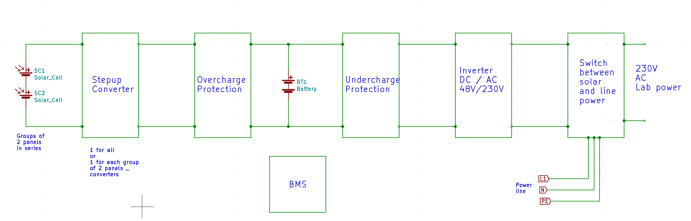
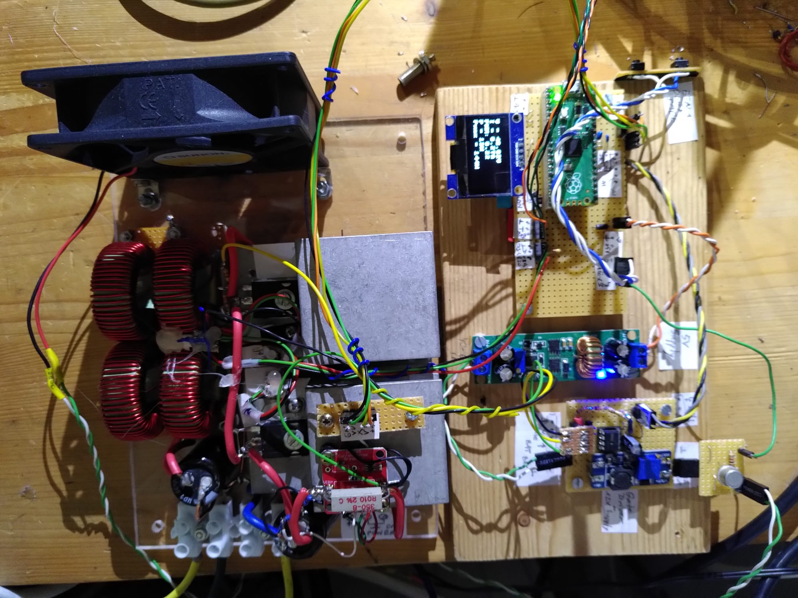

# SolarPower

Solar power using mainly standard and recycled components.

All of this is experimental. You are welcome to comment everything. 
Use circuit ideas at your own risk.

The battery is a BMWi3 battery that had been declared as "not good any more".

The panels are recycled solar panels I got for cheap. There are groups of 2 panels in series, and all of these are in parallel, via a protection diode.

Main component is the stepup converter.

My progress in developing it is documented in Stepup_solar_blog.pdf

Stepup converter 16.2.2024:

This circuit is able to work up to 1kW power.

### Open questions
- Is a battery management system really necessary?
- 
My first action was to start developing a battery management system as it seemed important to protect the battery.
Then I started to wonder if it is really necessary as there are groups of cells in parallel with a big capacity, and as the current is modest compared to the original application, an electric car.

My measurements in the last months showed only a tiny difference in cell voltages, less than 10mV, so maybe the BMS is not needed.

